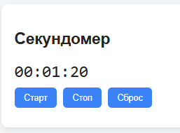
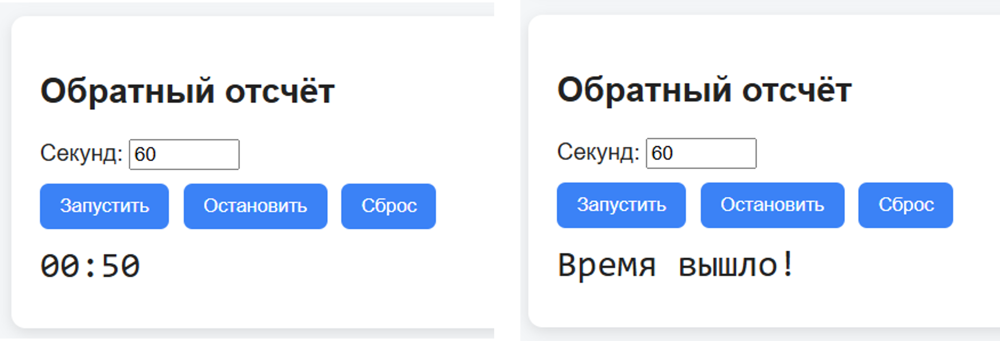
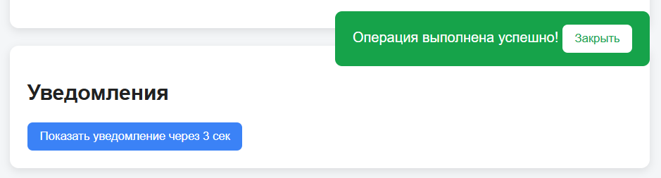
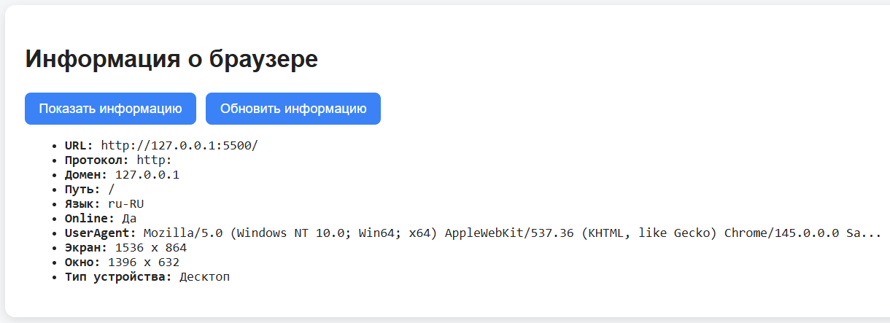
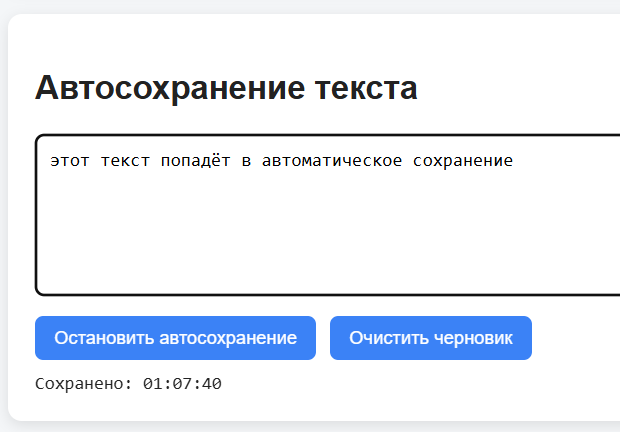
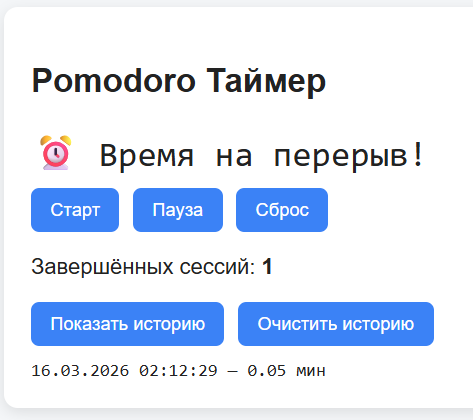

````markdown
# ⏱️ Практическая работа №5: BOM, Таймеры и Диалоговые Окна

> Проект «Управление временем и браузером» — закрепление тем: setTimeout, setInterval, BOM, localStorage, диалоговые окна.

🔗 [Посмотреть демо](https://igorao2802-dev.github.io/js-practice-05/) _(опционально)_  
📁 [Исходный код](https://github.com/igorao2802-dev/js-practice-05)

---

## 🛠 Используемые технологии

| Технология        | Назначение                                                                                              |
| ----------------- | ------------------------------------------------------------------------------------------------------- |
| HTML5             | Разметка страницы (Секундомер, Обратный отсчёт, Уведомления, Инфо о браузере, Автосохранение, Pomodoro) |
| CSS3              | Стилизация интерфейса (карточки, кнопки, уведомления, статусы)                                          |
| JavaScript (ES6+) | Таймеры (setTimeout/setInterval), BOM, localStorage, валидация                                          |

---

## 📋 Созданные функции и их назначение

### 🌍 Глобальные переменные

| Переменная                                | Тип    | Назначение                                               |
| ----------------------------------------- | ------ | -------------------------------------------------------- |
| `swInterval`, `cdInterval`, `pomInterval` | number | ID таймеров для секундомера, обратного отсчёта, Pomodoro |
| `autosaveInterval`                        | number | ID таймера автосохранения                                |
| `showTimeout`, `hideTimeout`              | number | ID таймеров для показа/скрытия уведомлений               |

---

### 🧮 Задание 1: Секундомер (setInterval) — Уровень БАЗА

| Функция             | Тип                  | Параметры | Возвращает | Назначение                           |
| ------------------- | -------------------- | --------- | ---------- | ------------------------------------ |
| `startStopwatch()`  | Function Declaration | —         | —          | Запуск секундомера через setInterval |
| `stopStopwatch()`   | Function Declaration | —         | —          | Остановка через clearInterval        |
| `resetStopwatch()`  | Function Declaration | —         | —          | Сброс времени на 00:00:00            |
| `updateStopwatch()` | Function Declaration | —         | —          | Обновление отображения времени       |

> 💡 **Почему setInterval**: Использую `setInterval`, потому что нужно увеличивать время каждую секунду многократно. `setInterval` выполняет функцию через равные промежутки времени (1000 мс).

```javascript
// setInterval: увеличивает время каждую секунду
// Использую setInterval, потому что нужно выполнять функцию многократно
swInterval = setInterval(() => {
  swSeconds++;
  updateStopwatch();
}, 1000);
```
````

---

### 🔍 Задание 2: Обратный Отсчёт (setInterval) — Уровень БАЗА

| Функция                 | Тип                  | Параметры        | Возвращает  | Назначение                                              |
| ----------------------- | -------------------- | ---------------- | ----------- | ------------------------------------------------------- |
| `startCountdown()`      | Function Declaration | —                | —           | Запуск обратного отсчёта                                |
| `stopCountdown()`       | Function Declaration | —                | —           | Остановка таймера                                       |
| `resetCountdown()`      | Function Declaration | —                | —           | Сброс и очистка поля ввода                              |
| `validateNumberInput()` | Function Declaration | `value` (string) | string/null | Валидация ввода (пустота, NaN, Infinity, отрицательные) |

> 💡 **Почему clearInterval**: Использую `clearInterval`, потому что нужно остановить повторяющийся таймер при достижении 0 или нажатии кнопки «Стоп».

```javascript
// clearInterval: останавливает таймер
// Использую clearInterval, потому что таймер достиг 0 и должен остановиться
if (cdSeconds <= 0) {
  clearInterval(cdInterval);
  cdDisplay.textContent = "Время вышло!";
}
```

---

### 🔔 Задание 3: Уведомления (setTimeout) — Уровень JUNIOR

| Функция       | Тип      | Параметры | Возвращает | Назначение                     |
| ------------- | -------- | --------- | ---------- | ------------------------------ |
| `showTimeout` | variable | —         | number     | ID таймера показа уведомления  |
| `hideTimeout` | variable | —         | number     | ID таймера скрытия уведомления |

> 💡 **Почему setTimeout**: Использую `setTimeout`, потому что нужно показать уведомление один раз через 3 секунды, а затем скрыть его один раз через 5 секунд. `setTimeout` выполняет функцию только один раз.

```javascript
// setTimeout: откладывает показ уведомления на 3 секунды
// Использую setTimeout, потому что нужно выполнить функцию один раз через задержку
showTimeout = setTimeout(() => {
  notifyBlock.style.display = "block";
  hideTimeout = setTimeout(() => {
    notifyBlock.style.display = "none";
  }, 5000);
}, 3000);
```

---

### 🌐 Задание 4: Информация о Браузере (BOM) — Уровень JUNIOR

| Объект BOM  | Свойство                                   | Назначение                         |
| ----------- | ------------------------------------------ | ---------------------------------- |
| `location`  | `href`, `protocol`, `hostname`, `pathname` | Информация об URL страницы         |
| `navigator` | `language`, `userAgent`, `onLine`          | Информация о браузере и устройстве |
| `screen`    | `width`, `height`                          | Разрешение экрана                  |
| `window`    | `innerWidth`, `innerHeight`                | Размер окна браузера               |

> 💡 **Почему BOM**: Использую объекты BOM, потому что нужно получить информацию о браузере, устройстве и текущей странице, которая недоступна через DOM.

```javascript
// BOM: получение информации о браузере
const isMobile = /Android|iPhone|iPad/i.test(navigator.userAgent);
const info = `
    URL: ${location.href}
    Язык: ${navigator.language}
    Экран: ${screen.width} x ${screen.height}
`;
```

---

### 💾 Задание 5: Автосохранение (setInterval + localStorage) — Уровень PRO

| Функция           | Тип                  | Параметры | Возвращает | Назначение                             |
| ----------------- | -------------------- | --------- | ---------- | -------------------------------------- |
| `saveDraft()`     | Function Declaration | —         | —          | Сохранение текста в localStorage       |
| `startAutosave()` | Function Declaration | —         | —          | Запуск автосохранения каждые 10 секунд |
| `stopAutosave()`  | Function Declaration | —         | —          | Остановка автосохранения               |

> 💡 **Почему setInterval + localStorage**: Использую `setInterval`, потому что нужно сохранять текст автоматически каждые 10 секунд. `localStorage` позволяет сохранить данные даже после перезагрузки страницы.

```javascript
// setInterval: автосохранение каждые 10 секунд
// Использую setInterval, потому что нужно выполнять сохранение многократно
autosaveInterval = setInterval(saveDraft, 10000);

// localStorage: сохранение текста
localStorage.setItem("draft", textarea.value);
```

---

### 🍅 Задание 6: Pomodoro Таймер (setInterval) — Уровень PRO

| Функция           | Тип                  | Параметры | Возвращает | Назначение                 |
| ----------------- | -------------------- | --------- | ---------- | -------------------------- |
| `startPomodoro()` | Function Declaration | —         | —          | Запуск таймера на 25 минут |
| `pausePomodoro()` | Function Declaration | —         | —          | Пауза таймера              |
| `resetPomodoro()` | Function Declaration | —         | —          | Сброс на 25:00             |

> 💡 **Почему clearInterval**: Использую `clearInterval`, потому что нужно остановить таймер при паузе, сбросе или завершении сессии.

```javascript
// setInterval: уменьшает таймер каждую секунду
pomInterval = setInterval(() => {
  pomSeconds--;
  if (pomSeconds <= 0) {
    clearInterval(pomInterval);
    pomDisplay.textContent = "⏰ Время на перерыв!";
  }
}, 1000);
```

---

## ❓ Ответы на контрольные вопросы (Interview Questions)

### 1. В чём разница между `setTimeout()` и `setInterval()`? Когда использовать каждый?

| Метод           | Как работает                                              | Когда использовать                     |
| --------------- | --------------------------------------------------------- | -------------------------------------- |
| `setTimeout()`  | Выполняет функцию **один раз** через указанную задержку   | Показ уведомления, отложенное действие |
| `setInterval()` | Выполняет функцию **многократно** через равные промежутки | Секундомер, таймер, автосохранение     |

**Пример:**

```javascript
// setTimeout: один раз через 3 секунды
setTimeout(() => {
  console.log("Показать уведомление");
}, 3000);

// setInterval: каждые 1 секунду
setInterval(() => {
  console.log("Тик секундомера");
}, 1000);
```

---

### 2. Что произойдёт, если не вызвать `clearInterval()`? Какие проблемы это может вызвать?

> Если не вызвать `clearInterval()`, таймер будет работать **бесконечно**, даже когда он больше не нужен.

**Проблемы:**

- 🔴 Увеличение нагрузки на процессор
- 🔴 Утечки памяти
- 🔴 Несколько параллельных таймеров (ускорение работы)
- 🔴 Неправильная работа интерфейса

**Пример:**

```javascript
// Правильно: останавливаем таймер
const timerId = setInterval(() => {
  console.log("Таймер работает");
}, 1000);
clearInterval(timerId); // Остановка
```

---

### 3. Что такое BOM? Назовите основные объекты BOM и их назначение.

> **BOM (Browser Object Model)** — набор объектов JavaScript для взаимодействия с браузером.

| Объект      | Назначение                                   |
| ----------- | -------------------------------------------- |
| `window`    | Главный объект браузера (глобальная область) |
| `navigator` | Информация о браузере и устройстве           |
| `location`  | Управление адресом страницы (URL)            |
| `screen`    | Информация о размере экрана                  |
| `history`   | Управление историей переходов                |

**Пример:**

```javascript
console.log(navigator.userAgent); // Информация о браузере
console.log(location.href); // Текущий URL
console.log(screen.width); // Ширина экрана
```

---

### 4. Как узнать, с мобильного ли устройства зашёл пользователь? Приведите пример кода.

> Нужно проверить строку `navigator.userAgent` с помощью регулярного выражения.

**Пример:**

```javascript
const isMobile = /Android|iPhone|iPad|iPod/i.test(navigator.userAgent);

if (isMobile) {
  console.log("Пользователь с мобильного устройства");
} else {
  console.log("Пользователь с компьютера");
}
```

---

### 5. Почему `alert()`, `confirm()` и `prompt()` считаются устаревшими? Какие у них недостатки?

> Эти функции **блокируют выполнение JavaScript** и интерфейс страницы.

**Недостатки:**

- 🔴 Блокируют интерфейс (пользователь не может нажать другие кнопки)
- 🔴 Нельзя стилизовать внешний вид
- 🔴 Ограниченный функционал
- 🔴 Плохой пользовательский опыт
- 🔴 Разный стиль в разных браузерах

**Пример:**

```javascript
// Устаревший способ:
alert("Сообщение");

// Современный способ: кастомное уведомление через DOM
notification.textContent = "Сообщение";
notification.style.display = "block";
```

---

### 6. Что делает метод `padStart()`? Зачем он нужен при работе с таймерами?

> **`padStart()`** добавляет символы в начало строки, чтобы она имела нужную длину.

**Зачем для таймеров:**

- Без `padStart()`: `5:3` (некрасиво)
- С `padStart()`: `05:03` (читаемый формат)

**Пример:**

```javascript
// Добавляем ноль в начало, если число меньше 10
"5".padStart(2, "0"); // "05"
"9".padStart(2, "0"); // "09"

// Для таймера:
const seconds = 5;
const formatted = String(seconds).padStart(2, "0"); // "05"
```

---

### 7. Как сохранить состояние таймера в `localStorage`, чтобы после перезагрузки страницы он продолжал работать?

> Нужно сохранять время таймера в `localStorage` и восстанавливать при загрузке страницы.

**Пример:**

```javascript
// Сохранение (каждую секунду)
localStorage.setItem("stopwatchSeconds", swSeconds);

// Восстановление (при загрузке страницы)
window.addEventListener("load", () => {
  const saved = localStorage.getItem("stopwatchSeconds");
  if (saved) {
    swSeconds = Number(saved);
    updateStopwatch();
  }
});
```

---

### 8. Что такое `location.href`? Как перенаправить пользователя на другую страницу через JavaScript?

> **`location.href`** — полный URL текущей страницы. Присваивание нового значения перенаправляет пользователя.

**Пример:**

```javascript
// Получить текущий URL
console.log(location.href);
// https://example.com/page

// Перенаправить на другую страницу
location.href = "https://google.com";
```

---

## 📸 Скриншоты работы

<!--






-->

---

_Выполнил: [JcОдчий И.А.]_  
_Дата: 16 Март 2026_
